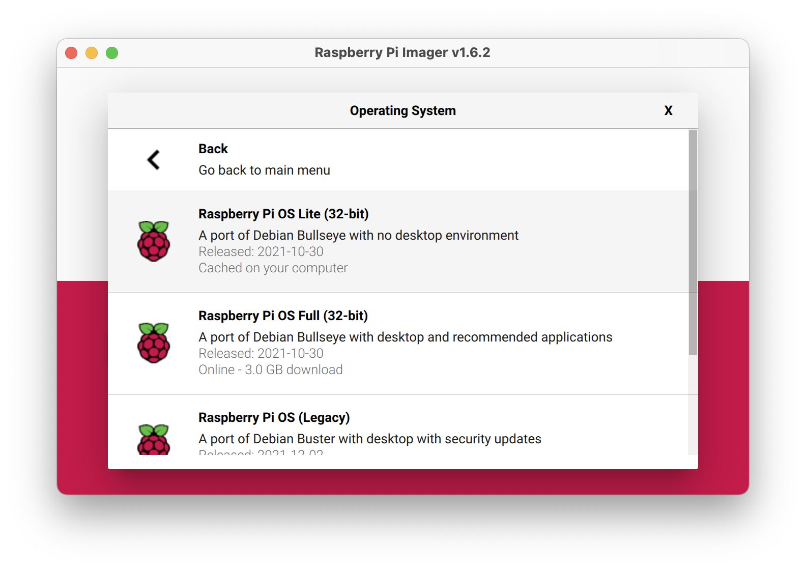

# Routeberry Pi

*Turn a Raspberry Pi into a router*

> Required: You must have a Raspberry Pi with a minimum of 2 physical network ports.

## Current State

- These scripts are tested work on a Raspberry Pi 4 and Raspberry Pi 3 with a canakit WiFi dongle.
- These scripts are tested with Raspberry Pi OS Lite (32 Bit) - [see Raspberry Pi OS Setup for more](#Raspberry_Pi_OS_Setup) 
- These scripts will will only setup the router to use `eth0` as the shared interface and `wlan0` as the router interface.
    - you can change this in the `/etc/hostapd/hostapd.conf` file.
    - plans to make the interface configurable are a work in progress
- These scripts will use:
    - Router IPv4 `192.168.1.1`
    - Router NAT Subnet `192.168.1.0/24`
    - Router IPv6 lab network `2001:db8::/128`
    - SSID "Spectrum Mobile"
    - WPA2 passphase "spectrum"

## Installing

There is a `scripts/install.sh` script that will install all the needed tools, once you have a fresh [install of Raspberry Pi OS](#Raspberry_Pi_OS_Setup)

1. install `git` onto the Raspberry Pi
```
sudo apt-get update
sudo apt-get install git -y
```
2. clone this repository
```
git clone https://github.com/popmedic/pi-router.git
```
3. change into the `pi-router` directory
```
cd pi-router
```
4. run the install
```
sh scripts/install.sh
```

## Starting

To start your Raspberry Pi as a router, you can run the `start.sh` script
1. make sure you are in the directory you cloned the project into
2. run the start script
```
sh scripts/start.sh
```

## Stopping

To stop using the Raspberry Pi as a router
1. make sure you are in the directory you cloned the project into
2. run the stop script
```
sh scripts/stop.sh
```

> NOTE: the stop will tear down all the network interfaces, including your `eth0` interface.  To start it back up you can use:
```
sudo ifup eth0
``` 

## Restarting

To restart using the Raspberry Pi as a router (when the pi is a router)
1. make sure you are in the directory you cloned the project into
2. run the restart script
```
sh scripts/restart.sh
```

## Raspberry Pi OS Setup

There are plenty of great tutorials on this.  Here is how I am setting up my Raspberry Pi OS Lite (32-bit)

1. [Download Raspberry Pi Imager](https://www.raspberrypi.com/software/)
2. Install the Imager
3. Run the Imager
4. Select Raspberry Pi OS Lite (32-bit) for the Operating System 

5. Choose the media you would like to burn onto
6. Click WRITE button

> NOTE: The default username is `pi` the default password is `raspberry`

> NOTE: you might want to select the correct [keyboard for the US.](https://forums.raspberrypi.com/viewtopic.php?t=251349)